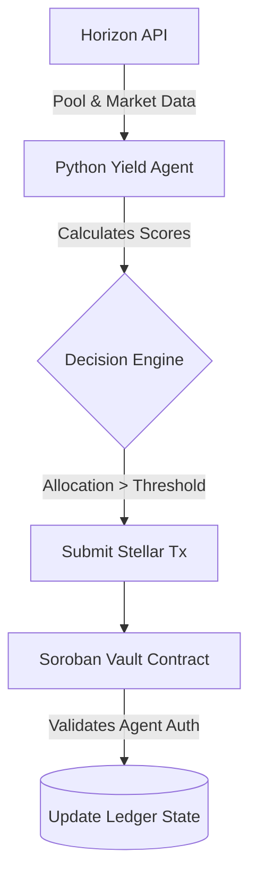

<h1 align="center">HaloPay Yield Contracts & Agent</h1>

<p align="center">
  The enterprise yield optimization repository for HaloPay — a hybrid on-chain and off-chain yield orchestrator built on Stellar and Soroban, maximizing USDC returns for merchants while maintaining strict liquidity thresholds.
</p>

<p align="center">
  <a href="https://github.com/HaloPaye/halopay-yield-contracts/actions"></a>
  <a href="LICENSE"></a>
  
  
</p>

---

## Core Architecture

This repository adopts a strict Domain-Driven Design (DDD), splitting logic across on-chain contracts and off-chain intelligence.

1. **Soroban Vault Contracts (Rust)**: Running natively on the Stellar network, these smart contracts contain core domain logic, vault state management, interface definitions, and uncompromising security/authorization checks.
2. **Yield Intelligence Agent (Python)**: Running off-chain, this daemon dynamically evaluates DeFi liquidity pools using a deterministic scoring model.
3. **Execution Engine**: The off-chain agent invokes Soroban cross-contract calls to execute optimized strategy allocations based on its real-time scoring metrics.

### Hybrid Flowchart



### How the Yield Orchestrator Works

1. **Market Ingestion:** The Python agent continuously polls the Stellar Horizon API to ingest real-time liquidity pool data, exchange rates, and historical volume metrics.
2. **Deterministic Scoring:** Using an internal heuristic engine, the agent scores each liquidity pool based on risk, yield potential, and available liquidity depth.
3. **Threshold Triggers:** If a pool's score exceeds a pre-defined threshold and aligns with the vault's risk profile, the decision engine queues an allocation transaction.
4. **On-Chain Execution:** The agent submits a signed transaction to the Soroban Vault Contract. The Rust contract validates the agent's cryptographic signature, ensures the allocation respects hard-coded limits, and executes the cross-contract call to deposit or withdraw funds.

---

## Stellar & Soroban Architecture Integration

HaloPay Yield Contracts & Agent leverages the unique composability and deterministic gas economics of the Stellar network:

* **Soroban Smart Contract Vaults:** Built in Rust utilizing the `soroban-sdk`, the on-chain vault manages merchant capital, enforces immutable safety caps (max 80% allocation, mandatory 20% liquid redemption reserve), and maintains reentrancy resistance.
* **Horizon & Soroban RPC Ingestion:** The autonomous Python daemon ingests real-time order books, AMM liquidity depths, and trading fees across the Stellar Decentralized Exchange (SDEX) and Soroban AMM pools.
* **Non-Custodial Merchant Yield:** Idle working capital accumulated by unbanked merchants via offline POS sales is programmatically deployed into yield-bearing Soroban strategies, protecting merchants from local currency inflation while maintaining instant off-ramp liquidity.

---

## Tech Stack

- **Language**: Rust, Python 3.11+
- **Smart Contracts**: Soroban SDK
- **Off-Chain Agent**: Pytest
- **Data Ingestion**: Stellar Horizon API
- **Testing & Simulation**: Soroban CLI, Make

---

## Setup & Quick Start

Check out the commands in the `Makefile` for everyday operations:

```bash
# Clone the repository
git clone https://github.com/HaloPaye/halopay-yield-contracts.git
cd halopay-yield-contracts

# Build the Soroban WASM artifacts
make build-wasm

# Run Rust contract tests
make test-contracts

# Run Python agent tests
make test-agent

# Format, lint, and type-check Python code
make lint

# Run the simulation loop
make simulate
```

## Maintainers & Contact

| Maintainer | Contact / Telegram | Role |
| :--- | :--- | :--- |
| HaloPay Team | [@HaloPayDev](https://t.me/HaloPayDev) | Core Protocol Engineering |

## Contributors

[](https://github.com/HaloPaye/halopay-yield-contracts/graphs/contributors)

---

## License

This project is licensed under the Apache License, Version 2.0 - see the [LICENSE](LICENSE) file for details.
