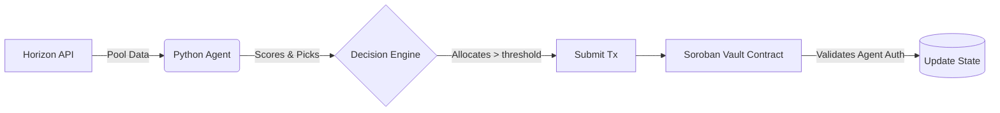

# HaloPay Yield Contracts & Agent

Welcome to the HaloPay enterprise yield optimization repository. This project is a hybrid on-chain and off-chain yield orchestrator built on Stellar and Soroban.

## Architecture

This repository adopts a strict Domain-Driven Design (DDD).

- **Contracts**: Written in Rust, running on Soroban. They contain core domain logic, interfaces, state management, and strict security and authorization checks.
- **Agent**: Written in Python, running off-chain. The agent evaluates liquidity pools using a deterministic scoring model and invokes Soroban cross-contract calls to execute strategy allocations.

### Hybrid Flowchart

## Running the Project

Check out the commands in the `Makefile`:
- `make test-contracts`: Run Rust tests
- `make test-agent`: Run Python pytest
- `make simulate`: Run the simulation loop
- `make build-wasm`: Build the Soroban WASM artifacts
- `make lint`: Format, lint, and type-check Python code
