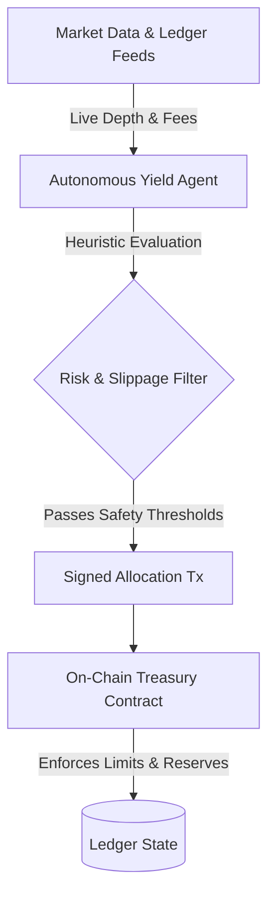

# HaloPay Treasury & Yield Engine

Non-custodial treasury vault smart contracts and autonomous market surveillance agent for merchant liquidity management and inflation protection.

[](https://github.com/HaloPaye/halopay-yield-contracts/actions)
[](LICENSE)
[](https://soroban.stellar.org)
[](https://www.python.org)

---

## Overview

Merchants in emerging markets holding digital balances face local currency depreciation and liquidity management challenges. The **HaloPay Treasury & Yield Engine** operates a dual-layer architecture:

1. **On-Chain Vaults**: Secure, non-custodial smart contracts holding merchant reserves with immutable safety constraints.
2. **Autonomous Surveillance Agent**: An off-chain Python daemon that continuously monitors decentralized liquidity pools, scores venues based on depth and volatility, and executes non-custodial rebalancing.

---

## System Architecture



### Safety Invariants

* **Mandatory Liquidity Reserve**: The vault contract enforces that a minimum of 20% of total assets remain completely liquid and uncommitted to ensure immediate merchant redemptions.
* **Emergency Circuit Breaker**: If price deviations or abnormal pool drains exceed safety parameters (e.g. >5% divergence), the circuit breaker automatically halts allocation operations.
* **Reentrancy Protection**: Strict checks-effects-interactions patterns across all cross-contract invocation boundaries.
* **Flash Loan Detection**: The off-chain agent evaluates trade volume spikes against historical means to detect multi-hop sandwich attacks before submitting transactions.

---

## Repository Structure

```
halopay-yield-contracts/
├── contracts/             # On-Chain Smart Contracts (Rust)
│   ├── Cargo.toml
│   └── src/
│       ├── core/          # Vault logic, share accounting, yield formulas
│       ├── interfaces/    # Liquidity pool and AMM traits
│       ├── state/         # Data structures and storage keys
│       └── security/      # Circuit breaker, access controls, timelocks
└── agent/                 # Autonomous Intelligence Agent (Python)
    ├── src/
    │   ├── domain/        # Heuristic scoring, AMM math, slippage guards
    │   └── infrastructure/# RPC feeds, stream monitors, metrics exporter
    └── tests/             # Pytest unit and integration test suite
```

---

## Quick Start

### Smart Contract Development (Rust)

```bash
# Run contract unit tests
cargo test

# Build WASM bytecode (requires soroban-cli)
soroban contract build
```

### Agent Setup & Testing (Python)

```bash
# Navigate to agent directory
cd agent

# Create virtual environment
python -m venv venv
source venv/bin/activate  # Or on Windows: .\venv\Scripts\activate

# Install dependencies
pip install -r requirements.txt

# Run test suite
python -m pytest tests/
```

---

## License

Licensed under the Apache License, Version 2.0 - see [LICENSE](LICENSE) for details.
